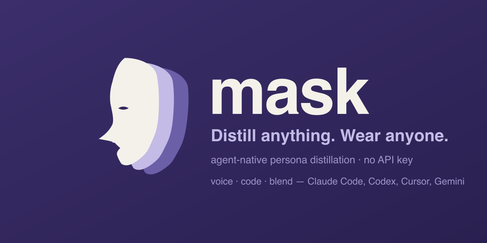

<p align="center"></p>
<p align="center">
  <a href="https://ttigger.github.io/mask"><b>Website</b></a>
  &nbsp;·&nbsp; <a href="https://github.com/TTigger/mask">GitHub</a>
  &nbsp;·&nbsp; <a href="README.zh-TW.md">繁體中文</a>
</p>
<p align="center">
  <a href="https://github.com/TTigger/mask/actions/workflows/ci.yml"></a>
  <a href="LICENSE"></a>
  
  
  
</p>

---

**mask** is an agent-native, open-source framework that distills any source — a blog, a YouTube channel, a GitHub repo, a PDF/book — into a switchable persona. Wear it, and the AI agent you already use (Claude Code, Codex, Cursor, Gemini…) answers in that source's voice and perspective. Fully local, no API key.

## Why "mask"

Three layers of meaning:

1. **persona** literally means "mask" in Latin — the face an actor wears. Swapping masks = swapping identities. That is exactly what mask does.
2. The craft tradition behind theatrical masks (Noh, opera): the wearer becomes the character in an instant. That "one breath, fully in character" mastery is the spirit of the project.
3. In CS, a **mask** is an overlay applied on top of something underneath. mask lays a persona over your base agent — your Claude Code is still Claude Code, but wearing a mask it answers with someone else's voice and knowledge.

mask also carries a faint "disguise / concealment" connotation; we keep that ambiguity on purpose — a mask both *reveals* (lets you embody someone) and *conceals* (wraps the base agent). The icon echoes it: a profile mask trailing overlapping shadow clones — you distilled someone, then wore their shadow.

## Core ideas

- **Distill anything** into a persona — three flavors: **voice** (how they talk and think), **code** (a repo's conventions and idioms), **blend** (a voice-neutral synthesis of several sources).
- **Evidence-bound**: every claim is cited to a source sample `[src:…]` and traceable back to its origin; thin evidence is declared, not hidden.
- **Local and yours**: each mask is a folder of Markdown + Git on your machine, hand-editable.
- **Agent-native, zero API key**: the framework calls no LLM; extraction and answering borrow your own subscribed agent's compute.
- **Many personas, switch like skills**: wear whichever the moment needs.

## Talk to it (zero-learning)

After you clone the repo, you drive everything in natural language inside your agent — you never need to learn the CLI:

```
"distill this blog for me"     # ingest -> your agent extracts -> saved to your local library
"what masks do I have"         # roster
"wear fireship"                # switch; the next turns answer in that voice
"ask gilfoyle: ..."            # one-off, without changing the default
```

## Install & run

Requires [Bun](https://bun.sh). The framework is distributed as a cloned repo (the tool); your masks live separately in `~/.mask/` (its own Git repo).

```sh
git clone https://github.com/TTigger/mask && cd mask
./install.sh        # installs deps + puts a `mask` launcher on your PATH
```

`install.sh` drops a tiny launcher that runs the CLI from this checkout, so `git pull` updates it — no rebuild. Then, from any project:

```sh
mask init                              # Claude Code (default): orchestrator → ~/.claude/CLAUDE.md
cd your-project && mask init --agent agents-md --out .   # or a universal AGENTS.md in your project
```

> **Then start a new agent session** so it picks up the freshly installed orchestrator — now just say *"distill this blog and let me wear it."* `init` only has to be run once (it's idempotent; re-run it anytime to refresh). Until you've run it, your agent doesn't know the mask workflow.

(Prefer no installer? `bun run dev <command>` runs the CLI straight from the clone.)

Two adapters cover every agent:

- **`claude-code`** — personas coexist as subagents under `~/.claude/agents/`; `wear` flips a sticky global default. Best for switching between many masks.
- **`agents-md`** — writes one project-level **`AGENTS.md`**, the [cross-tool standard](https://agentsmd.io) read natively by **Codex, Gemini CLI, Cursor, Windsurf, Zed, Continue, Goose** and 30+ others. Single-active: `wear` swaps the persona into a `mask:active` block. `--out <dir>` chooses the project (it installs into the current directory otherwise).

Setup is identical up to `init`; only the target differs:

| | **Claude Code** | **Everyone else** (Codex · Gemini · Cursor · Windsurf · Zed · …) |
|---|---|---|
| init | `mask init` | `cd your-project && mask init --agent agents-md --out .` |
| installs to | `~/.claude/CLAUDE.md` (**global**) | `your-project/AGENTS.md` (**project-level**) |
| scope | worn everywhere | per-project (one AGENTS.md per repo) |
| personas | many coexist as subagents; `wear` flips a sticky default | single-active; `wear` swaps the `mask:active` block |
| who reads it | Claude Code only | one AGENTS.md → 30+ tools, natively |

Your masks (`~/.mask/`) and every command are **agent-agnostic** — distill once, wear in Claude today and Cursor tomorrow; only the *wearing* mechanism adapts. To drive Claude Code from the same universal file too, add `@AGENTS.md` to your `CLAUDE.md` (import) or symlink `CLAUDE.md → AGENTS.md`.

To ship a standalone binary (no Bun at runtime), build one — note it needs `MASK_FRAMEWORK` pointed at the clone so it can find the recipes/templates:

```sh
bun run build           # -> ./bin/mask   (this platform)
bun run build:all       # -> ./bin/mask-{macos-arm64,linux-x64,windows-x64.exe}
bun test                # the deterministic-core test suite
```

Per-source tools (only needed for that source kind): `git` for repos, `yt-dlp` for YouTube, `pdftotext` (poppler) for PDFs. Blogs need none.

### Command surface

The CLI is deterministic and calls **no LLM** — your agent does the intelligent work by following the recipe. You normally drive these in natural language (see above), but they exist directly too:

| | |
|---|---|
| `mask init` | create the library + install the orchestrator |
| `mask ingest <src…>` | fetch a source (blog / YouTube / repo / PDF) into samples; `--blend` merges several into one voice-neutral mask |
| `mask reduce <dir>` | dedup / sample / cap → a context-sized digest |
| `mask redistill <slug> <src…>` | re-ingest a source and stage only what changed (version bump) |
| `mask scale <dir>` | opt-in: map-reduce a too-large corpus via your own headless agent CLI |
| `mask compile <slug>` | mask.md → the current agent's native persona file |
| `mask wear <slug>` · `list` · `status` | switch / roster / who's worn |
| `mask coverage <slug>` | how much evidence the mask stands on (from its provenance) |
| `mask statusline` | a compact active-mask badge for an agent statusline |
| `mask unwear` · `remove <slug>` | clean up managed artifacts / delete a mask |

### Environment

- `MASK_HOME` — library location (default `~/.mask`).
- `MASK_CLAUDE_MD` — Claude Code orchestrator file (default `~/.claude/CLAUDE.md`).
- `MASK_AGENTS_MD` — the AGENTS.md install target (default `./AGENTS.md`; `init --out <dir>` sets this).
- `MASK_FRAMEWORK` — set this when running the **standalone compiled binary** so the agent can still find the on-disk recipe/templates; point it at the cloned repo. (Unnecessary with `bun run`/`bunx`, which resolve them automatically.)

## License

MIT
