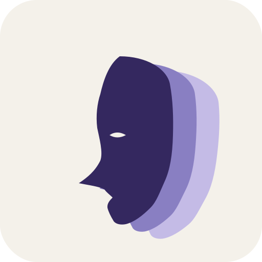

<p align="center"></p>
<h1 align="center">mask</h1>
<p align="center"><em>Distill anything. Wear anyone.</em></p>
<p align="center"><a href="README.zh-TW.md">繁體中文</a></p>

---

**mask** is an agent-native, open-source framework that distills any source — a blog, articles, a YouTube channel, code, a GitHub repo — into a switchable persona. Wear it, and the AI agent you already use (Claude Code, Codex, Cursor, Gemini…) answers in that source's voice and perspective. Fully local, no API key.

## Why "mask"

Three layers of meaning:

1. **persona** literally means "mask" in Latin — the face an actor wears. Swapping masks = swapping identities. That is exactly what mask does.
2. The craft tradition behind theatrical masks (Noh, opera): the wearer becomes the character in an instant. That "one breath, fully in character" mastery is the spirit of the project.
3. In CS, a **mask** is an overlay applied on top of something underneath. mask lays a persona over your base agent — your Claude Code is still Claude Code, but wearing a mask it answers with someone else's voice and knowledge.

mask also carries a faint "disguise / concealment" connotation; we keep that ambiguity on purpose — a mask both *reveals* (lets you embody someone) and *conceals* (wraps the base agent). The icon echoes it: a profile mask trailing overlapping shadow clones — you distilled someone, then wore their shadow.

## Core ideas

- **Distill anything** into a persona.
- **Voice-first (v1)**: capture how they talk and think; knowledge is secondary, cited, and bounded.
- **Local and yours**: each mask is a folder of Markdown + Git on your machine, hand-editable.
- **Agent-native, zero API key**: the framework calls no LLM; extraction and answering borrow your own subscribed agent's compute.
- **Many personas, switch like skills**: wear whichever the moment needs.

## Talk to it (zero-learning)

After you clone the repo, you drive everything in natural language inside your agent — you never need to learn the CLI:

```
"distill this blog for me"     # ingest -> your agent extracts -> saved to your local library
"what masks do I have"         # roster
"wear fireship"                # switch; the next turns answer in that voice
"ask gilfoyle: ..."            # one-off, without changing the default
```

## Install & run

Requires [Bun](https://bun.sh). The framework is distributed as a cloned repo (the tool); your masks live separately in `~/.mask/` (its own Git repo).

```sh
git clone <this-repo> mask && cd mask
bun install
bun run dev init                   # Claude Code (default): orchestrator → ~/.claude/CLAUDE.md
bun run dev init --agent agents-md # or a single-active file: AGENTS.md | GEMINI.md | .cursor/rules
```

Four agents are supported (`--agent claude-code | agents-md | gemini | cursor`). **Claude Code** personas coexist as subagents (`wear` flips the sticky active default). **AGENTS.md**, **Gemini** (`GEMINI.md`), and **Cursor** (`.cursor/rules/mask.mdc`) are single-active — `wear` swaps the persona inline into a `mask:active` block. The same mask compiles to any of them.

`bun run dev <command>` runs the CLI from source. Or build a standalone binary:

```sh
bun run build           # -> ./bin/mask   (this platform)
bun run build:all       # -> ./bin/mask-{macos-arm64,linux-x64,windows-x64.exe}
bun test                # the deterministic-core test suite
```

Per-source tools (only needed for that source kind): `git` for repos, `yt-dlp` for YouTube, `pdftotext` (poppler) for PDFs. Blogs need none.

### Command surface

The CLI is deterministic and calls **no LLM** — your agent does the intelligent work by following the recipe. You normally drive these in natural language (see above), but they exist directly too:

| | |
|---|---|
| `mask init` | create the library + install the orchestrator |
| `mask ingest <src…>` | fetch a source (blog / YouTube / repo / PDF) into samples; `--blend` merges several into one voice-neutral mask |
| `mask reduce <dir>` | dedup / sample / cap → a context-sized digest |
| `mask redistill <slug> <src…>` | re-ingest a source and stage only what changed (version bump) |
| `mask scale <dir>` | opt-in: map-reduce a too-large corpus via your own headless agent CLI |
| `mask compile <slug>` | mask.md → the current agent's native persona file |
| `mask wear <slug>` · `list` · `status` | switch / roster / who's worn |
| `mask coverage <slug>` | how much evidence the mask stands on (from its provenance) |
| `mask statusline` | a compact active-mask badge for an agent statusline |
| `mask unwear` · `remove <slug>` | clean up managed artifacts / delete a mask |

### Environment

- `MASK_HOME` — library location (default `~/.mask`).
- `MASK_CLAUDE_MD` — Claude Code orchestrator file (default `~/.claude/CLAUDE.md`).
- `MASK_AGENTS_MD` · `MASK_GEMINI_MD` · `MASK_CURSOR_MDC` — single-active targets (defaults `./AGENTS.md`, `./GEMINI.md`, `./.cursor/rules/mask.mdc`).
- `MASK_FRAMEWORK` — set this when running the **standalone compiled binary** so the agent can still find the on-disk recipe/templates; point it at the cloned repo. (Unnecessary with `bun run`/`bunx`, which resolve them automatically.)

## Status

The full roadmap (`docs/PRD.md` -> `SPEC.md` -> `PHASES.md`) is implemented:

- **Phase 0** — deterministic CLI (ingest → reduce → compile → wear), Claude Code adapter.
- **Phase 1** — AGENTS.md adapter (second agent) + YouTube ingest.
- **Phase 2** — knowledge-first `type: code` flavor + repo ingest + multi-mask scope; Cursor & Gemini adapters.
- **Phase 3** — re-distillation (`redistill`), headless scale mode (`scale`), PDF/book ingest, blended masks, coverage/roster/statusline polish.

Four agents, four source kinds (blog / YouTube / repo / PDF), three mask flavors (voice / code / blend). Dogfooded against a real blog, YouTube channel, and GitHub repo (`docs/DOGFOOD.md`); deterministic core covered by 81 tests. Traditional Chinese companions live in `docs/zh-TW/`.

## License

MIT
